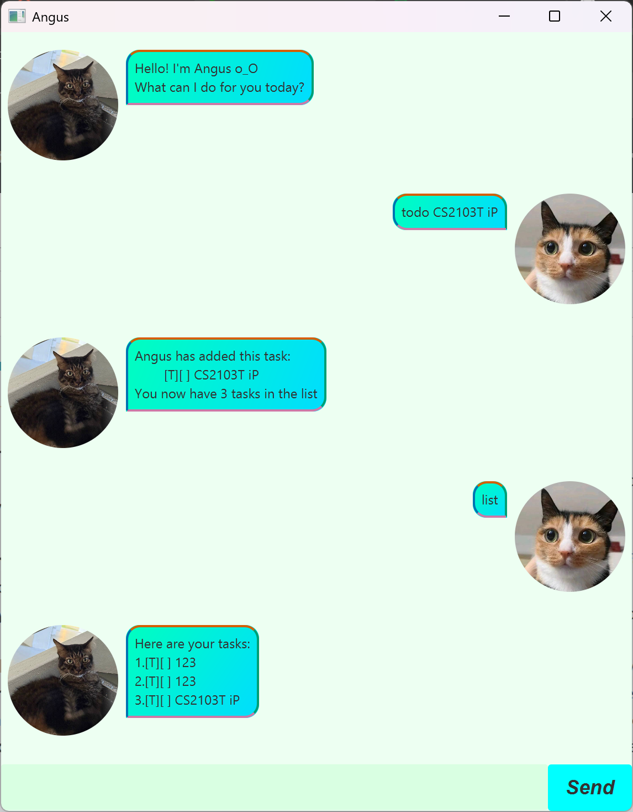

# Angus User Guide


Angus is a desktop application that allows you to manage your tasks through simple command line instructions on a Graphical User Interface (GUI). Tasks are categorised into todos, deadlines and events.

## Adding todos: `todo`
Adds a todo task to your task list with the specified name.

Format: `todo TASKNAME`

- Creates a new todo task with the name `TASKNAME`

Example: 
`todo Study for quiz`

Angus will respond with an acknowledgment of the todo task added, indicated with [T].

```
Angus has added this task:
    [T][ ] Study for quiz
You now have 1 tasks in the list
```

## Adding deadlines: `deadline`
Adds a deadline task to your task list with the specified name and the deadline date.

Format: `todo TASKNAME /by YYYY-MM-DD`

- Creates a new deadline task with the name `TASKNAME` and the deadline date of `YYYY-MM-DD`
- The format of the date must be in `YYYY-MM-DD` format.

Example:
`deadline Submit quiz /by 2025-09-17`

Angus will respond with an acknowledgment of the deadline task added, indicated with [D].

```
Angus has added this deadline:
    [D][ ] Submit quiz (by: Sep-17-2025)
You now have 2 tasks in the list
```

## Adding events: `event`
Adds a event task to your task list with the specified name, start date and end date.

Format: `event TASKNAME /from YYYY-MM-DD /to YYYY-MM-DD`

- Creates a new event task with the name `TASKNAME`, with start date and end date specified by `YYYY-MM-DD` respectively.
- The format of the date must be in `YYYY-MM-DD` format.

Example:
`event Hackathon /from 2025-09-20 /to 2025-09-22`

Angus will respond with an acknowledgment of the event task added, indicated with [E].

```
Angus has added this event:
    [E][ ] Hackathon (from: Sep-20-2025 to: Sep-22-2025)
You now have 3 tasks in the list
```

## Listing your tasks: `list`
Lists the tasks that you have in your task list in order added.

Format: `list`

Angus will respond with the list of tasks you have, with the corresponding label for each type of task.

```
Here are your tasks:
1.[T][ ] Study for quiz
2.[D][ ] Submit quiz (by: Sep-17-2025)
3.[E][ ] Hackathon (from: Sep-20-2025 to: Sep-22-2025)
```

## Marking task as done: `mark`
Marks a specified task in your list as done.

Format: `mark TASKNUM`

- Marks the task with the task number of TASKNUM as done, as specified by the numbering given in the `list` command.
- Tasks marked as done will have the label [X].

Example:
`mark 1`

Angus will respond with an acknowledgment of successfully marking the task as done.

```
Angus has marked this task as done!
    [T][X] Study for quiz
```

## Marking task as not done: `unmark`
Marks a specified task in your list as ___NOT___ done. (i.e. undo the marking of a task)

Format: `unmark TASKNUM`

- Marks the task with the task number of TASKNUM as ___NOT___ done, as specified by the numbering given in the `list` command.
- Tasks marked as ___NOT___ done will have the label [ ].

Example:
`unmark 1`

Angus will respond with an acknowledgment of successfully marking the task as ___NOT___ done.

```
Angus has marked this task as NOT done!
    [T][ ] Study for quiz
```

## Finding tasks by name: `find`
Finds tasks based on the filter keyword provided

Format: `find KEYWORD`

- Finds all tasks who have `KEYWORD` in the task name (case-sensitive)

Example:
`find quiz `

Angus will respond with a list of tasks that has the filter keyword in the task name.

```
Here are the matching tasks in your list
1.[T][ ] Study for quiz
2.[D][ ] Submit quiz (by: Sep-17-2025)
```

## Sorting tasks: `sort`
Sorts your task list based on start date for events, or deadline for deadline tasks. Sorting is not allowed for todo tasks.

Format: `sort TASKTYPE`

- `TASKTYPE` can only either be event or deadline

Example:
`sort deadline `

Angus will respond with a list of (deadlines/events) by (deadline date/start date).

```
Here is your sorted list of deadlines:
1.[D][ ] Submit quiz (by: Sep-17-2025)
2.[D][ ] Complete assignment (by: Sep-25-2025)
```

## Deleting a task: `delete`
Deletes a specified task in your list.

Format: `delete TASKNUM`

- Deletes the task with the task number of `TASKNUM`, as specified by the numbering given in the `list` command.
- Deleted tasks are permanently removed.

Example:
`delete 1`

Angus will respond with an acknowledgment of successfully deleting the task

```
All done! Angus has removed this task:
    [D][ ] Complete assignment (by: Sep-25-2025)
You now have 3 tasks in your list
```

## Exiting the program: `bye`
Exits the program.

Format: `bye`